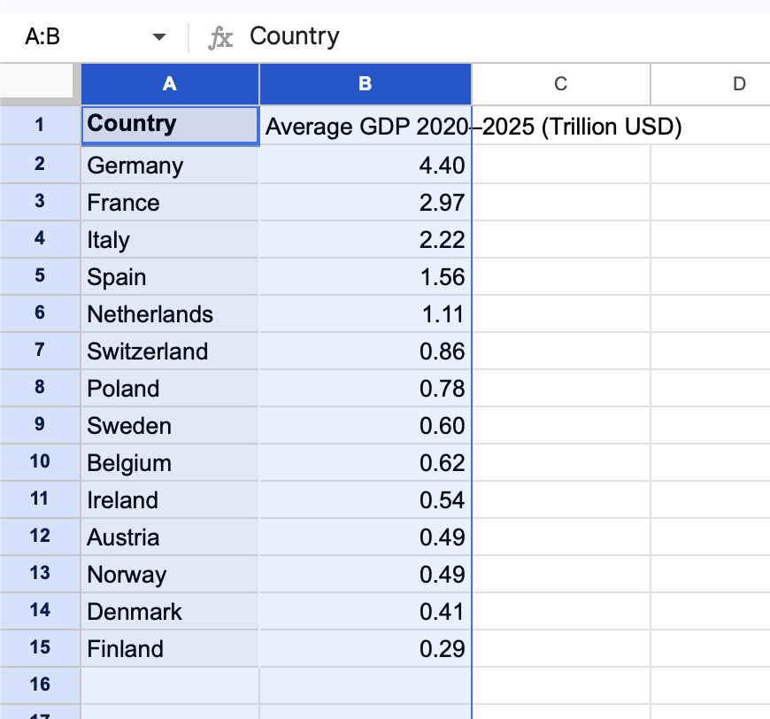
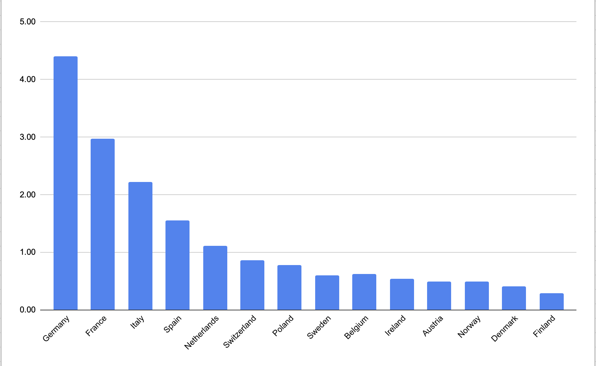

# EU GDP Analysis 2020–2025

This project analyzes the average GDP of selected EU countries between 2020 and 2025 using Google Sheets.

## Project Objective

The goal of this project is to compare the average GDP of selected EU countries and present the results in a simple and clear format.

## Tools Used

- Google Sheets
- Basic spreadsheet formulas
- Data cleaning
- Bar chart visualization
- GitHub

## What I Did

- Collected GDP data for selected EU countries from 2020 to 2025
- Calculated the average GDP for each country
- Converted large numbers into trillion USD
- Created a clean table for comparison
- Created a bar chart to visualize the results

## Dataset

The dataset includes GDP values from 2020 to 2025.  
The data was organized and cleaned in Google Sheets.

## Formula Used

The average GDP was calculated using:

```excel
Then the result was converted into trillion USD:

```excel
=H2/1000000
```

## Files

- `eu-gdp-analysis-2020-2025.xlsx` — spreadsheet file
- `table.png` — cleaned final table
- `bar-chart.png` — GDP comparison chart

## Final Table



## Visualization



## Key Insight

Germany had the highest average GDP among the selected EU countries during 2020–2025, followed by France and Italy.

## License

This project is licensed under the MIT License.
=AVERAGE(B2:G2)
